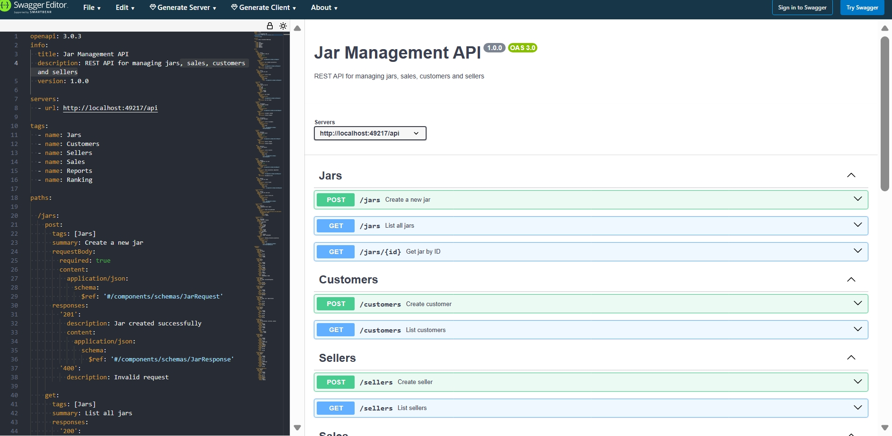
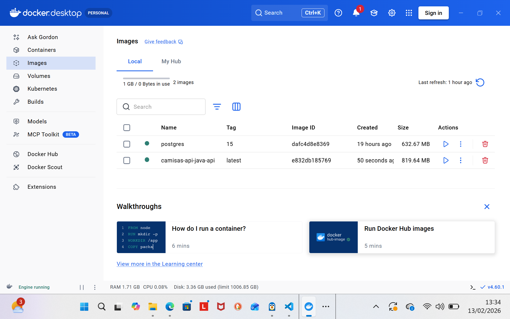
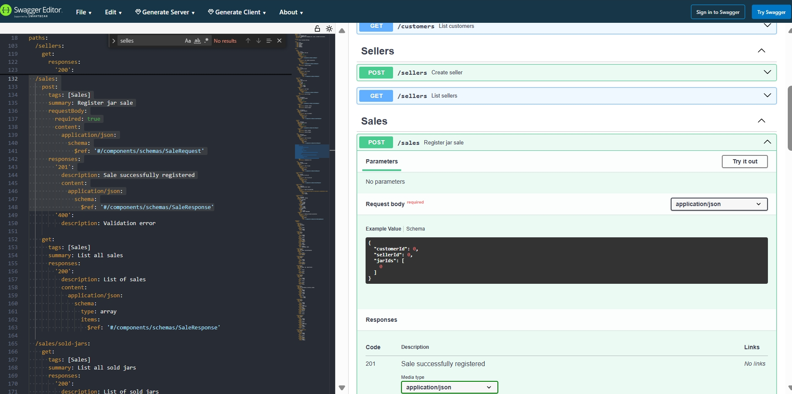

# Jar Management API

## 📌 Overview

REST API developed with **Java + Spring Boot** for managing jars, customers, sellers, sales, reports, and seller rankings.

---

## 🚧 Project Status

This project is currently **under development**.

Some features may still be incomplete, under testing, or subject to change. Improvements, refactoring, validations, and test coverage are being implemented continuously.

---

## 🛠 Technologies Used

- Java 17+
- Spring Boot
- Spring Web
- Spring Data JPA
- Hibernate
- PostgreSQL / MySQL
- Flyway (Database Migration)
- Docker
- Swagger / OpenAPI
- Apache POI (Excel Reports)
- JUnit / Mockito

---

## 📁 Project Structure


```
jar-management-api/
├── src/
│   ├── main/
│   │   ├── java/com/example/jarmanagement/
│   │   │   ├── JarManagementApplication.java
│   │   │   ├── config/
│   │   │   │   ├── OpenApiConfig.java
│   │   │   │   └── SwaggerConfig.java
│   │   │   ├── resource/
│   │   │   │   ├── JarResource.java
│   │   │   │   ├── CustomerResource.java
│   │   │   │   ├── SellerResource.java
│   │   │   │   ├── SaleResource.java
│   │   │   │   ├── ReportResource.java
│   │   │   │   └── RankingResource.java
│   │   │   ├── service/
│   │   │   ├── repository/
│   │   │   ├── entity/
│   │   │   ├── dto/
│   │   │   ├── exception/
│   │   │   └── util/
│   │   └── resources/
│   │       ├── application.yml
│   │       └── db/migration/
│   │           ├── V1__create_tables.sql
│   │           ├── V2__add_indexes.sql
│   │           └── V3__insert_initial_data.sql
│   └── test/
│       └── java/com/example/jarmanagement/
├── docker/
│   ├── Dockerfile
│   └── docker-compose.yml
├── pom.xml
├── .gitignore
└── README.md
```


## 📸 Screenshots

| Layer        | Description                          |
|--------------|--------------------------------------|
| [Site swagger -> editor.swagger.io ](https://editor.swagger.io/) |[Code YML (Código) -> github.com/luizacerchiari-cloud-solution-architect/API/blob/main/imgs/swagger.yml](https://github.com/luizacerchiari-cloud-solution-architect/API/blob/main/imgs/swagger.yml)        |
|

### 1️⃣ Image 1


---

### 1️⃣ Image inicio


---

### 2️⃣ Image 2


---

### 3️⃣ Image 3



